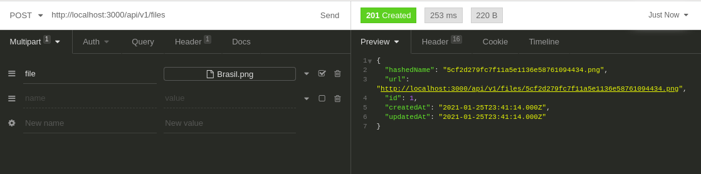
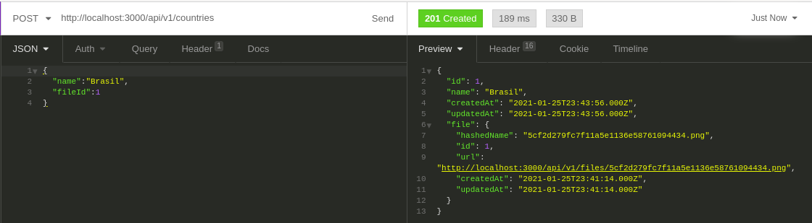
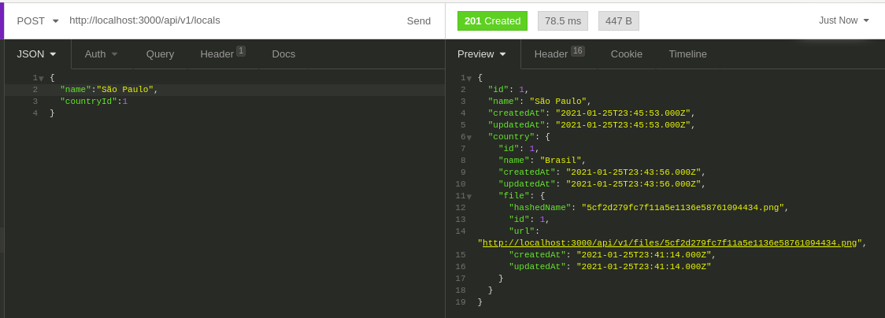
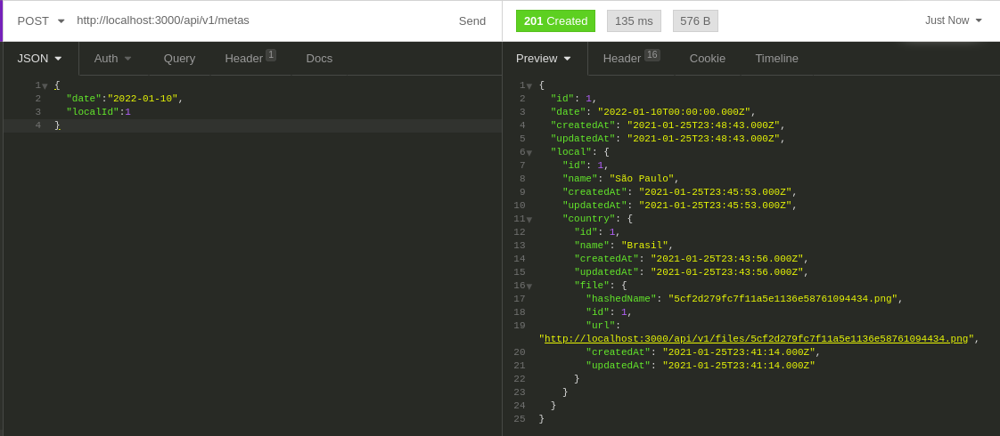

# Desafio de Backend


- [Descrição](#descrição)
  - [O Desafio](#o-desafio)
  - [Requisitos Obrigatórios](#requisitos-obrigatórios)
  - [Bônus](#bônus)
- [Submissão e Prazo de Entrega](#submissão-e-prazo-de-entrega)
- [Instruções de execução](#instruções-de-execução)
  - [Requisitos para execução](#requisitos-para-execução)
  - [Instalação das dependências](#instalação-das-dependências)
  - [Variáveis de ambiente](#variáveis-de-ambiente)
  - [Container Docker](#container-docker)
  - [Migrações](#migrações)
  - [Execução da aplicação](#execução-da-aplicação)
- [Endpoints disponíveis](endpoints-disponíveis)
  - [Recursos para Files](#recursos-para-files)
  - [Recursos para Countries](#recursos-para-countries)
  - [Recursos para Locals](#recursos-para-locals)
  - [Recursos para Metas](#recursos-para-metas)
- [Jornada de criações POST do cliente da API](#jornada-de-criações-post-do-cliente-da-api)


## Descrição

Este desafio tem como objetivo avaliar as habilidades técnicas do candidato a vaga de desenvolvedor backend no Clubpetro.

#### O Desafio

O desafio consiste em desenvolver uma API rest que permita o CRUD de lugares para se conhecer ao redor do mundo para alimentar o frontend que pode ser visto na imagem a seguir:


Os dados a ser considerados são:

- País: O país escolhido;
- Local: O local dentro do país escolhido;
- Meta: O mês e o ano que o usuário pretende visitar o local;
- Url da bandeira do país;
- Data de criação do registro;
- Data de atualização do registro.

#### Requisitos Obrigatórios

> Requisitos que serão avaliados no desafio.

- A API deverá ser desenvolvida com Node.js e Express;
- Apenas o Local e a Meta poderão ser editados;
- O mesmo local em determinado país não poderá ser adicionado de forma duplicada;
- A listagem dos dados deverá ser ordenada de forma crescente pela meta;
- O candidato deverá adicionar ao projeto uma explicação de como executar a aplicação.

#### Bônus

> Requisitos que não são obrigatórios mas podem te deixar em vantagem com relação aos outros candidatos.

- Utilização do framework [NestJS](https://nestjs.com/);
- Typescript;
- Testes automatizados;
- [TypeORM](https://typeorm.io/#/);
- [Docker](https://www.docker.com/);
- Deploy para [Google Cloud Platform](https://cloud.google.com/) (ao criar conta é possível receber um bonus para teste).

### Submissão e Prazo de entrega

- O candidato deverá realizar um fork deste repositório e submeter o código no mesmo.
- Em caso do deploy realizado, a url deverá ser adicionada no README;
- O prazo de entrega para este desafio é de 2 (duas) semanas, contando a partir do dia em que o canditado recebeu o email com o link do repositório;
- Ao finalizar o desafio, o candidato deverá enviar um email para jobs@clubpetro.com.br contendo o link do seu PR.


# Instruções de execução

## Requisitos para execução

Para executar a aplicação no ambiente de desenvolvimento, precisamos ter no ambiente:

- [Docker](https://www.docker.com/)
- [Docker Compose](https://docs.docker.com/compose/install/)
- [yarn](https://classic.yarnpkg.com/en/docs/install/#debian-stable)
- [nest-cli](https://docs.nestjs.com/cli/overview)

## Instalação das dependências

Dentro do diretório raiz do projeto, podemos executar

```bash
$ yarn
```
para instalar as dependências.

## Variáveis de ambiente

Duplique o arquivo .env.example presente na raiz do projeto e renomeie uma das cópias para apenas .env

O arquivo .env contém as variáveis de ambiente com informações secretas que serão utilizadas na API.

## Container Docker

Após instalar as dependências, podemor subir o container contendo o serviço MySQL.

O serviço relativo ao banco de dados MySQL está configurado para escutar a porta 3306. Caso essa porta já esteja sendo usada em seu ambiente, deixe ela disponível para o container, por favor.

Após esses detalhes, podemos executar:

```bash
$ docker-compose up
```

Esse processo pode demorar um pouco caso as imagens Docker não estejam disponíveis em seu ambiente local.

## Migrações

Após o container contendo o MySQL estiver disponível para conexões, execute o seguinte comando para executar as migrações no banco de dados:

```bash
$ yarn typeorm migration:run
```

## Execução da aplicação

Agora podemos iniciar a aplicação (modo de desenvolvimento) executando:

```bash
# development mode
$ yarn start
```

# Endpoints disponíveis

A URL base no ambiente de desenvolvimento é http://localhost:3000/api/v1/

***Obs***: As listagens utilizam [eager loading](https://orkhan.gitbook.io/typeorm/docs/eager-and-lazy-relations) para carregar os dados das relações.

## Recursos para Files

***Obs***: Files é o arquivo relativo a bandeira de um país.

- `POST /files`: Cria um novo arquivo enviado como multipart/form a chave `file`. O arquivo deve ser uma imagem com extensão `.png`, `.jpg` ou `.jpeg`

- `GET /files/:id`: O arquivo com `id` presente no parâmetro da rota deve ter seus dados retornados.

## Recursos para Countries

- `POST /countries`: 
O endpoint deve receber `name` e `fileId` no corpo da requisição e registrar um novo país.

- `GET /countries`: 
Rota que lista todos os países presentes no repositório.

- `GET /countries/:id`: 
O país com `id` presente no parâmetro da rota deve ter seus dados retornados.

- `DELETE /countries/:id`: 
O País com `id` presente no parâmetro da rota deve ser excluído.

- `GET /countries/:id/locals`:
Retorna os locais relacionados ao `id` do País presente no parâmetro da rota.


## Recursos para Locals

- `POST /locals`: 
O endpoint deve receber `name` e `countryId` no corpo da requisição e registrar um novo local.

- `GET /locals`: 
Rota que lista todos os locais presentes no repositório.

- `GET /locals/:id`: 
O local com `id` presente no parâmetro da rota deve ter seus dados retornados.

- `DELETE /locals/:id`: 
O local com `id` presente no parâmetro da rota deve ser excluído.

- `PUT /locals/:id`: 
O endpoint pode receber `name` e `countryId` no corpo da requisição e alterar o local relativo ao `id` presente no parâmetro da rota.


## Recursos para Metas

- `POST /metas`: 
O endpoint deve receber `date` (ISO-8601) e `localId` no corpo da requisição para registrar uma nova meta.

- `GET /metas`: 
Rota que lista todas as metas presentes no repositório.

- `GET /metas/:id`: 
A meta com `id` presente no parâmetro da rota deve ter seus dados retornados.

- `DELETE /metas/:id`: 
A meta com `id` presente no parâmetro da rota deve ser excluída.

- `PUT /metas/:id`:
O endpoint pode receber `date` no corpo da requisição e alterar a meta relativa ao `id` presente no parâmetro da rota.


# Jornada de criações POST do cliente da API

Nesta seção temos um exemplo com requisições POST nos principais endpoints da API usando o [Insomnia](https://insomnia.rest/).
O objetivo é criar uma meta com todos os seus dados relacionados (bandeira, local e país)

1) Receber um arquivo (bandeira). Veja mais em [Recursos para Files](#recursos-para-files))



2) Criar um novo país. Veja mais em [Recursos para Countries](#recursos-para-countries)



3) Criar um local "dentro" do país. Veja mais em [Recursos para Locals](#recursos-para-locals)



4) Criar uma meta associada a um local. Veja mais em [Recursos para Metas](#recursos-para-metas)

