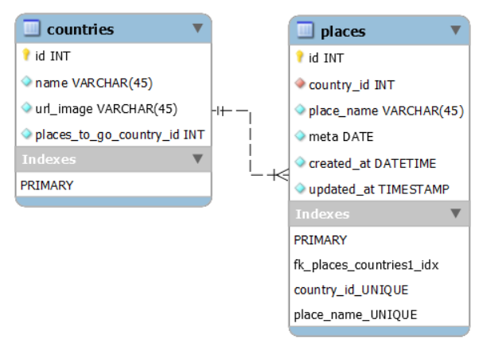

# Desafio de Backend ClubPetro

- [Descrição](#descrição)
  - [Regras de Negócio](#regras-de-negócio)
- [Diagrama EER](#Diagrama-EER)
- [Tecnologias utilizadas](#🔥-tecnologias-utilizadas)
- [Instruções para Inicializar](#✨-instruções-para-inicializar)
- [Rotas de API](#📭-rotas-da-API)

## Descrição

O desafio consiste em desenvolver uma API rest que permita o CRUD de lugares para se conhecer ao redor do mundo para alimentar o frontend que pode ser visto na imagem a seguir:

Os dados a serem considerados são:

- País: O país escolhido;
- Local: O local dentro do país escolhido;
- Meta: O mês e o ano que o usuário pretende visitar o local;
- Url da bandeira do país;
- Data de criação do registro;
- Data de atualização do registro.

#### Regras de Negócio:

- O mesmo local em determinado país não poderá ser adicionado de forma duplicada;
- Apenas o Local e a Meta poderão ser editados;
- A listagem dos dados deverá ser ordenada de forma crescente pela meta;

## Diagrama EER:

Para solução desse desafio foi planejado a estrutura de dados para modelagem do banco de dados relacional abaixo:  

## 🔥 Tecnologias utilizadas:

  **Back-end:** Node.js, TypeScript, Express, Orientação a Objetos e Testes com Mocha, Chai e Sinon  
  **Banco de Dados:** SQL MySQL, Sequelize (ORM)  

## ✨ Instruções para Inicializar:

  Clone o repositório: `git clone git@github.com:fa-biano/backend-challenge-club-petro.git`
  
  > Necessário ter o Docker e o docker-compose instalados localmente

  Execute o comando no terminal `docker compose up -d` para subir os 2 containers da aplicação: app_backend e ap_db 

  Após finalizar o processo de build do docker compose, todas as dependências estarão instaladas, banco de dados configurado e a API estará em execução e pronta para uso.

  

    
<strong>Variáveis de Ambiente</strong>
 
    Não há necessidade de configurar um arquivo .env nesse projeto.  
    No entanto, caso haja necessidade de fazer alguma alteração, crie um arquivo .env com as variáveis abaixo:

    `API_PORT=3001`
    `MYSQL_HOST=app_db`
    `MYSQL_PORT=3306`
    `MYSQL_USER=root`
    `MYSQL_PASSWORD=password`
    `MYSQL_DB_NAME=CLUB_PETRO`
  

  #### ⚠️ Importante:
  * O processo de build do docker compose pode demorar por volta de 1 minuto para finalizar.  
  * Ao finalizar o build é feito um health check nos containers antes deles iniciarem. Esse processo pode levar por volta de 30 segundos.

  Utilize o Insomnia ou qualquer outro client de sua preferência para testar as rotas disponíveis.

## 📭 Rotas da API:

O Backend está rodando na porta `3001`. Seguem as rotas que podem ser acessadas:

  `/countries`:  
    - GET: lista todos os países cadastrados;  

  `/places`:  
    - GET: lista todos os lugares ordenados pela data de meta de viagem;  
    - POST: adiciona novo lugar e meta de viagem;  
    - PUT: atualiza o lugar e a meta conforme o id informado;  
    - DELETE: exclui o lugar conforme o id informado;  
