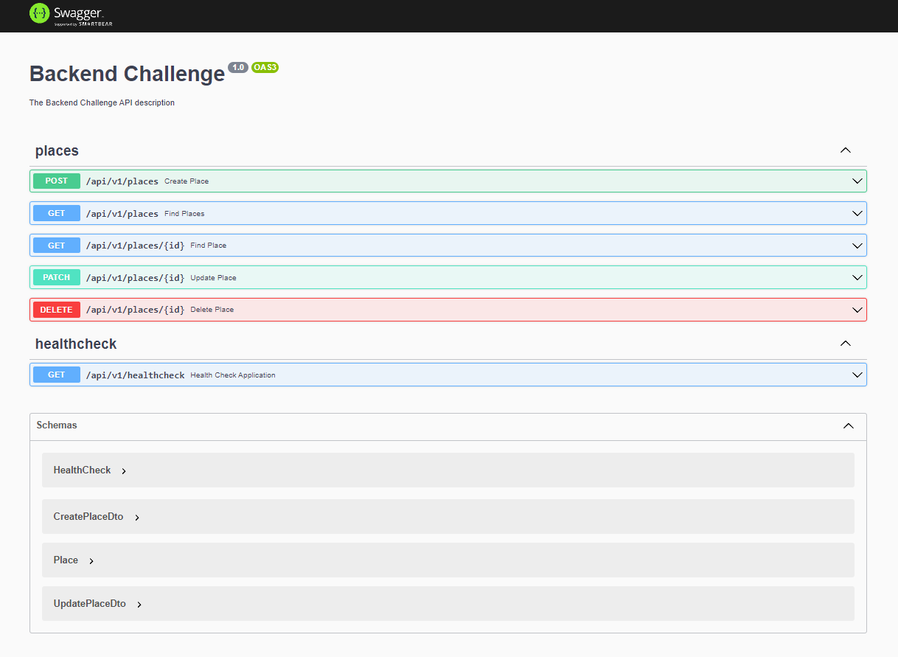

<h1 align="center">
     🌍 <a href="#" alt="site do places"> Places Serverside</a>
</h1>

<h3 align="center">
    🧳 Sua api para gerenciar lugares para se conhecer ao redor do mundo. 💚
</h3>

<div align="center">
<p align="center">
<a></a>
<a href='https://coveralls.io/github/andrewronscki/places-serverside?branch=main'></a>
<a></a>
<a></a>
<a></a>
<a></a>
</p>
</div>

Tabela de conteúdos
=================
<!--ts-->
   * [Sobre o projeto](#-sobre-o-projeto)
   * [Funcionalidades](#%EF%B8%8F-funcionalidades)
   * [Como executar o projeto](#-como-executar-o-projeto)
     * [Pré-requisitos](#pré-requisitos)
     * [Rodando o Backend (servidor)](#-rodando-o-backend-servidor)
   * [Tecnologias](#-tecnologias)
     * [Server](#server--nestjs)
     * [Infra](#infra-terraform)
   * [Estrutura do Projeto](#-estrutura-do-projeto)
   * [Autor](#-autor)
   * [Licença](#-licença)
<!--te-->


## 💻 Sobre o projeto

🌍 Places Serverside - é uma forma de gerenciar lugares para você conhecer, podendo cadastrar, atualizar, buscar e remover lugares.


É uma API rest que permita o CRUD de lugares para se conhecer ao redor do mundo para alimentar seu clientside.

Swagger da aplicação disponível em: https://api.places.andrewronscki.com/docs

<div align="center">
  
</div>

---

## ⚙️ Funcionalidades

- [x] Lugares:
  - [x] Cadastrar lugar
  - [x] Atualizar lugar
  - [x] Buscar um lugar
  - [x] Buscar todos os lugares
  - [x] Remover um lugar

---

## 🚀 Como executar o projeto

### Pré-requisitos

Antes de começar, você vai precisar ter instalado em sua máquina as seguintes ferramentas:
[Git](https://git-scm.com), [Node.js](https://nodejs.org/en/), [Docker](https://docs.docker.com/desktop/), [NestJS](https://nestjs.com/).
Além disto é bom ter um editor para trabalhar com o código como [VSCode](https://code.visualstudio.com/)

#### 🎲 Rodando o Backend (servidor)

```bash

# Clone este repositório
$ git clone git@github.com:andrewronscki/backend-challenge.git

# Acesse a pasta do projeto no terminal/cmd
$ cd backend-challenge

# Instale as dependências
$ npm install

# Crie um arquivo .env com o conteúdo do .env.example
$ cp .env .env.example

# Faça as alterações no arquivo .env caso tenha necessidade

# Execute a aplicação com docker-compose
$ docker-compose up

# O servidor inciará na porta:9001 - acesse http://localhost:9001/docs

```
<p align="center">
  <a href="https://github.com/andrewronscki/places-serverside/blob/main/insomnia.json" target="_blank"></a>
</p>

---

## 🛠 Tecnologias

As seguintes ferramentas foram usadas na construção do projeto:

#### [](https://github.com/andrewronscki/places-serverside)**Server** ([NestJS](https://nodejs.org/en/))
-   **[Typescript](https://www.typescriptlang.org/)**
-   **[Postgres](https://www.postgresql.org/)**
-   **[TypeORM](https://typeorm.io/)**
-   **[Jest](https://jestjs.io/pt-BR/)**
-   **[dotENV](https://github.com/motdotla/dotenv)**
-   **[Docker](https://docs.docker.com/engine/install/ubuntu/)**
#### [](https://github.com/andrewronscki/places-infrastructure)**Infra** ([Terraform](https://www.terraform.io/))
-   **[AWS](https://aws.amazon.com/pt/)**

> Projeto da infraestrutura do projeto https://github.com/andrewronscki/places-infrastructure

> Veja o arquivo  [package.json](https://github.com/andrewronscki/places-serverside/blob/main/package.json)

---

## 🛠 Estrutura do Projeto
A estrutura do projeto segue este modelo:
- O sistema deve ser desenvolvido utilizando os ensinamentos do Clean Architecture e Domain-Driven Design, separando as camadas em domain, data, infra e presentation;
- O sistema deve ser agrupado por módulos independentes;
- O desenvolvimento dos casos de uso deve ser orientado a testes (TDD).

<div align="center">
  
</div>

---

## 🦸 Autor

<a href="https://andrewronscki.com">
 
 <br />
 <sub><b>André Wronscki Ricardo</b></sub></a> <a href="https://andrewronscki.com" title="André Wronscki">🚀</a>
 <br />
 <br />


[](https://www.linkedin.com/in/andr%C3%A9-wronscki-ricardo-13694bb7/)
[](mailto:andrewronscki@gmail.com)

---

## 📝 Licença

Este projeto esta sobe a licença [MIT](./LICENSE.md).
